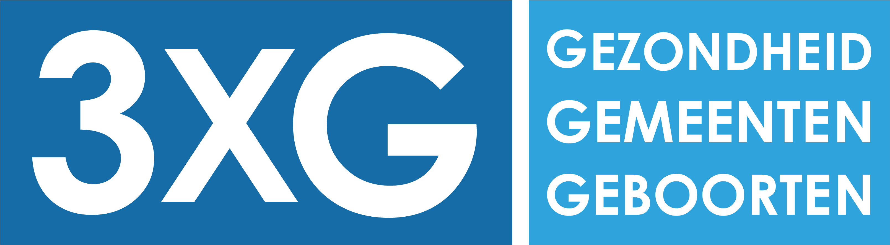

# Workshop 3XG

Via deze [link](https://meijerij.github.io/Workshop-3XG/) vind je de bijbehorende informatie voor het project.

In de map [`Data`](Data) staat momenteel een voorbeelddataset. Eens de hypothese voor jullie project bepaald is, zal hier het dataset worden toegevoegd.

 
