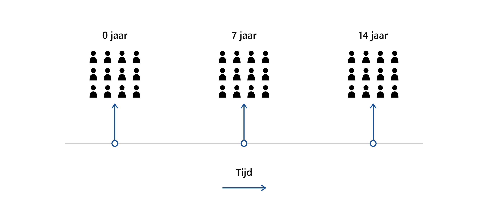

# Introductie {#sec-intro}

[3XG](https://studie3xg.be/nl), wat staat voor ‘Gezondheid – Gemeenten – Geboorten’, is een studie die opgestart werd in 2010 in de regio Dessel-Mol-Retie. Het 3XG project maakt deel uit van één van de verschillende initiatieven die een positieve impact moeten hebben op de werkgelegenheid, de welvaart en het welzijn in de regio. Het wordt uitgevoerd door een onderzoeksteam van drie wetenschappelijke partners: VITO, PIH en Universiteit Antwerpen. Het doel van de studie is de opvolging van de **(milieu)gezondheid** van de inwoners uit de regio Dessel-Mol-Retie. De studie bestaat uit twee onderdelen: 

  - Humane biomonitoring (geboortecohort)
  - Analyse van ziekte- en sterfteregisters.
  
**Voor het project zullen we de focus leggen op de humane biomonitoring van het geboortecohort.**

## Studie design 3XG

### Humane biomonitoring via geboortecohort

Een geboortecohorte is een **prospectieve studie** die een bepaalde populatie doorheen de 
tijd opvolgt. In dit geval gaat het om een actieve geboortecohorte van pasgeborenen uit de 
regio Dessel-Mol-Retie. Er werden 301 pasgeboren baby’s uit de regio gerekruteerd tussen 
2011 en 2015. Via humane biomonitoring, een techniek die de blootstelling van milieuvervuilende stoffen in het lichaam meet, werden in 
navelstrengbloed, moedermelk, bloed en urine van de moeder gehaltes aan vervuilende stoffen
en gezondheidsparameters gemeten. Zo kan de milieugezondheid van de pasgeborenen in Dessel,
Mol en Retie vergeleken worden met Vlaanderen. Op 7 en 14 jaar werden alle kinderen opnieuw
uitgenodigd voor een humaan biomonitoringsonderzoek. 

{#fig-diagram width=100% fig-align="center"}

### Analyse van ziekte- en sterfteregisters

Elke 5 jaar wordt een rapport gepubliceerd met de resultaten van de analyses van de bestaande ziekte- en sterfteregisters. Het gaat om de meest recente gegevens in verband met overlijden, kanker, hospitalisaties en aangeboren afwijkingen. Het is de bedoeling om na te gaan of de gegevens van de regio vergelijkbaar zijn met de algemene Vlaamse gegevens, en om tijdstrends te bekijken. Daarom wordt maximaal gestreefd naar een vergelijkbaarheid met de vroegere rapporteringen.

